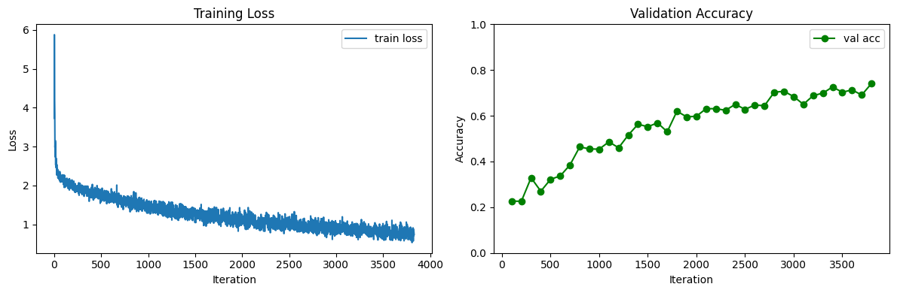

# CS231n (2025) — Complete Solutions

> Stanford CS231n: Deep Learning for Computer Vision — **2025 最新版** Assignment 1 / 2 全部完成，Assignment 3 目前完成了 **Q1 Transformer Captioning**  
> 作者: m0NESY0501 ｜ [知乎专栏](https://www.zhihu.com/column/c_1988741880209507029)

---

## 🏆 Highlight: Custom ResNet on CIFAR-10 (Open-ended Challenge)

在 Assignment 2 的开放性挑战中，我**从零设计并训练了一个 ResNet 架构**，在 CIFAR-10 上取得以下成绩：

| 指标 | 结果 |
|------|------|
| **验证集最高准确率** | **74.1%** |
| **测试集准确率** | **71.74%** （课程要求 ≥70%）|
| 训练轮次 | 10 epochs |
| 训练时长 | ~10 min (单 GPU) |

### 架构设计思路

```
Input(3×32×32)
  → Conv2d(3→128, 5×5, padding=2)
  → [ResConv × 4]          ← 残差卷积块，保持空间尺寸不变
  → MaxPool2d(2)            ← 下采样至 16×16
  → [ResConv × 4]          ← 更深的特征提取
  → AdaptiveAvgPool2d(1×1)  ← Global Average Pooling，消除全连接层参数爆炸
  → Dropout(0.5)
  → Linear(128→10)
```

**每个 ResConv 块：** `GroupNorm(8 groups) → Conv2d(3×3) → LeakyReLU(0.1)` + 残差连接

**关键设计决策：**

- 使用 **GroupNorm** 代替 BatchNorm — 对小 batch size 更稳定（Assignment 2 的 BatchNormalization 实验启发）
- 使用 **Global Average Pooling** 代替 Flatten+多层FC — 大幅减少参数量，缓解过拟合
- 使用 **LeakyReLU** 代替 ReLU — 缓解 dying ReLU 问题
- 使用 **Kaiming 初始化** — 适配 LeakyReLU 的方差分析
- **Cosine Annealing LR** + **Adam** — 训练末期平滑收敛

### 训练曲线

<p align="center">
  
</p>

> Loss 在 10 epoch 内从 ~6.0 稳定下降至 ~0.7；验证准确率从 22% 持续攀升至 74.1%

---

## ✨ Highlight: Transformer Captioning

在 Assignment 3 中，我目前完成了 **Q1: Transformer_Captioning.ipynb**，实现了 **Transformer Decoder / Multi-Head Attention / Positional Encoding** 这一条主线，把图像描述任务从 **RNN Captioning** 推进到 **Attention-based Captioning**。

### Transformer Captioning 设计思路

```
Image Features
  → Linear Projection              ← 将视觉特征映射到词向量维度
  → Memory Tokens

Caption Tokens
  → Word Embedding
  → Positional Encoding            ← 显式注入序列位置信息
  → Masked Self-Attention          ← 保证自回归生成时不能偷看未来 token
  → Cross-Attention                ← 用文本 token 查询图像特征
  → Feed Forward Network
  → Linear to Vocabulary
  → Greedy Decoding at Test Time
```

**已完成的核心模块：**

- **Scaled Dot-Product Multi-Head Attention** — 支持 self-attention 与 cross-attention 两种模式
- **Sinusoidal Positional Encoding** — 无需额外可学习参数即可编码 token 顺序
- **Transformer Decoder Layer** — `self-attn → cross-attn → FFN`，每层包含残差连接与 LayerNorm
- **CaptioningTransformer** — 从图像特征到词表分布的端到端生成模型，并支持 greedy sampling

**这一部分的价值：**

- 从 **循环结构** 过渡到 **并行注意力结构**，更贴近现代 NLP / CV 大模型的基本范式
- 明确理解 **causal mask、cross-attention、位置编码** 等 Transformer 核心组件
- 为后续完成 Assignment 3 其余问题打下 Transformer 基础

---

## 📋 项目总览

本仓库包含 Stanford CS231n (2025) 的主要实现，覆盖从**纯 NumPy 手写反向传播**到 **PyTorch 模型训练**，再到 **RNN 图像描述** 与 **Transformer Captioning** 的实践过程。

### Assignment 1 — 从零实现经典分类器

所有前向/反向传播均使用 **纯 NumPy 向量化实现**，不依赖任何深度学习框架。

| 任务 | 核心实现 | 要点 |
|------|---------|------|
| **Q1 KNN** | [k_nearest_neighbor.py](assignment1/cs231n/classifiers/k_nearest_neighbor.py) | 无循环/单循环/双循环三种向量化实现；交叉验证选 k |
| **Q2 Softmax** | [softmax.py](assignment1/cs231n/classifiers/softmax.py) | 数值稳定的 softmax + 交叉熵损失；解析梯度 vs 数值梯度验证 |
| **Q3 Two-layer Net** | [fc_net.py](assignment1/cs231n/classifiers/fc_net.py) | 完整的两层网络训练流程（含反向传播 + 正则化）|
| **Q4 Feature Engineering** | [features.py](assignment1/cs231n/features.py) | HoG + 颜色直方图特征提取 |
| **Q5 Fully Connected Nets** | [layers.py](assignment1/cs231n/layers.py), [fc_net.py](assignment1/cs231n/classifiers/fc_net.py) | 模块化的任意深度全连接网络；Solver 训练框架 |

### Assignment 2 — CNN、正则化技术与 PyTorch

| 任务 | 核心实现 | 要点 |
|------|---------|------|
| **Convolutional Networks** | [cnn.py](assignment2/cs231n/classifiers/cnn.py), [layers.py](assignment2/cs231n/layers.py) | 手写 Conv/Pool 前向反向传播（含 im2col 加速）|
| **Batch Normalization** | [layers.py](assignment2/cs231n/layers.py) | BN/GroupNorm/LayerNorm 的前向反向传播 + 训练/测试模式切换 |
| **Dropout** | [layers.py](assignment2/cs231n/layers.py) | Inverted Dropout 实现 + 不同 dropout rate 对训练的影响实验 |
| **PyTorch** | [PyTorch.ipynb](assignment2/PyTorch.ipynb) | Barebone / nn.Module / nn.Sequential 三种范式 + **自定义 ResNet**（见上方 Highlight）|
| **RNN Image Captioning** | [rnn_pytorch.py](assignment2/cs231n/classifiers/rnn_pytorch.py), [rnn_layers_pytorch.py](assignment2/cs231n/rnn_layers_pytorch.py) | Vanilla RNN + LSTM 图像描述生成（COCO 数据集）|

### Assignment 3 — 当前进度：Q1 Transformer Captioning

| 任务 | 核心实现 | 要点 |
|------|---------|------|
| **Transformer Captioning** | [transformer.py](assignment3/cs231n/classifiers/transformer.py), [transformer_layers.py](assignment3/cs231n/transformer_layers.py) | Multi-Head Attention、Positional Encoding、Decoder Layer、图像条件文本生成 |

> 说明：Assignment 3 共 4 个 question，目前仓库中已完成并整理的是 **Q1 `Transformer_Captioning.ipynb`**。

---

## 🔧 技术栈

- **底层实现**: NumPy（手写所有层的前向/反向传播）, SciPy, Cython（im2col 加速）
- **框架训练**: PyTorch（CNN / RNN / Transformer Captioning）
- **实验工具**: Jupyter Notebook, matplotlib
- **验证方法**: 数值梯度检验（`gradient_check.py`）确保手写层的反向传播正确

## 🚀 快速开始

```bash
# 1. 克隆 & 安装依赖
pip install numpy scipy matplotlib jupyter torch

# 2. 进入对应 assignment 目录并设置路径
cd assignment3
set PYTHONPATH=%CD%    # Windows

# 3. 启动 notebook
jupyter notebook Transformer_Captioning.ipynb
```

## 📁 关键文件索引

```
assignment1/
├── cs231n/
│   ├── layers.py                    # 全连接层、ReLU、Softmax Loss 前向/反向
│   ├── gradient_check.py            # 数值梯度检验工具
│   ├── solver.py                    # 通用训练框架
│   ├── classifiers/
│   │   ├── k_nearest_neighbor.py    # KNN 三种向量化实现
│   │   ├── softmax.py               # Softmax 分类器
│   │   └── fc_net.py                # 任意深度全连接网络
│   └── features.py                  # HoG + 颜色直方图

assignment2/
├── cs231n/
│   ├── layers.py                    # Conv, Pool, BN, LN, GN, Dropout 前向/反向
│   ├── im2col.py                    # im2col 矩阵展开加速卷积
│   ├── classifiers/
│   │   ├── cnn.py                   # 三层 CNN 分类器
│   │   └── rnn_pytorch.py           # RNN/LSTM Image Captioning 模型
│   └── rnn_layers_pytorch.py        # RNN/LSTM 单步 + 序列前向/反向
├── PyTorch.ipynb                    # ⭐ 含自定义 ResNet 的 Open-ended Challenge
└── RNN_Captioning_pytorch.ipynb     # RNN 图像描述实验

assignment3/
├── cs231n/
│   ├── transformer_layers.py        # Multi-Head Attention / Positional Encoding / Decoder Layer
│   ├── captioning_solver_transformer.py  # Transformer Captioning 训练器
│   └── classifiers/
│       └── transformer.py           # ⭐ Captioning Transformer
└── Transformer_Captioning.ipynb     # Assignment 3 Q1：Transformer 图像描述生成实验
```

## 📝 学习记录

每完成一个 Assignment 都同步更新技术博客，包含实现思路、踩坑记录与实验分析：

📖 **知乎专栏**: [CS231n 2025 学习笔记](https://www.zhihu.com/column/c_1988741880209507029)
